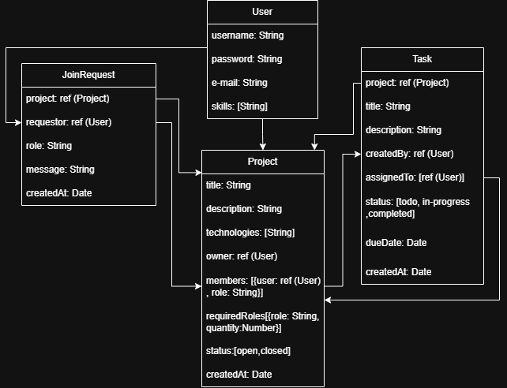
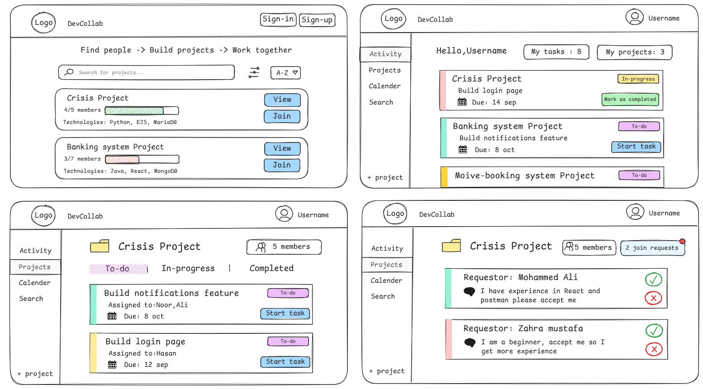

# Code Crew
## Overview
CodeCrew is a web-based platform where like-minded coders can lookup interesting projects that may require contributors or create a project idea and request members to help in bringing the project to life. This platform allows beginners to learn collaboration and trade skills with each other while also providing startup creatives to allow experienced developers provide help in the creation of their unique ideas.

## Screenshot / Logo

## User Stories
- As a guest and registered user, I must be able to search for available projects and filter by technologies and sort by alphabetical order
- As a signed-in user I must be able to create, update, delete, and view projects
- As a signed-in user I must be able to request to join an available team within a project
- As a signed-in user I must be able to accept/reject a join request made by another user
- As a member of the team, I must be able to create, update, delete, and view tasks

## Getting Started
- Deployed App: https://codecrew-frontend-lime.vercel.app/
- Backend Repository: https://github.com/Mohammed-M8/codecrew-backend

## Entity-Relationship Diagram

## Wireframes

## Express & Postman

Below you can see a chart outlining the RESTful routes required for this application:

| HTTP Method | Controller             | Response | URI                                              | Use Case                                                   |
|-------------|------------------------|----------|--------------------------------------------------|------------------------------------------------------------|
| **Auth**    |                        |          |                                                  |                                                            |
| GET         | signToken              | 200      | /auth/sign-token                                 | Sign a token                                               |
| POST        | verifyToken            | 200      | /auth/verify-token                               | Verify a token                                             |
| POST        | signup                 | 201      | /auth/sign-up                                    | Sign up a user                                             |
| POST        | login                  | 200      | /auth/sign-in                                    | Sign in a user                                             |
| **Users**   |                        |          |                                                  |                                                            |
| GET         | activity               | 200      | /users/:userId/activity                          | Get the signed-in user's active assigned tasks             |
| **Projects**|                        |          |                                                  |                                                            |
| GET         | index                  | 200      | /projects                                        | Get all open projects                                      |
| GET         | getUsersProjects       | 200      | /projects/me                                     | Get the signed-in user's projects                          |
| GET         | show                   | 200      | /projects/:projectId                             | Get a single project                                       |
| POST        | create                 | 201      | /projects                                        | Create a project                                           |
| PUT         | update                 | 200      | /projects/:projectId                             | Update a project                                           |
| DELETE      | delete                 | 204      | /projects/:projectId                             | Delete a project                                           |
| GET         | getProjectMembers      | 200      | /projects/:projectId/members                     | Get project members                                        |
| DELETE      | deleteMember           | 204      | /projects/:projectId/members/:memberId           | Remove a project member                                    |
| **Join Requests** |                  |          |                                                  |                                                            |
| GET         | getOwnerJoinRequests   | 200      | /projects/join-requests                          | Get requests for projects owned by the signed-in user      |
| GET         | getUserJoinRequests    | 200      | /projects/my-join-requests                       | Get requests sent by the signed-in user                    |
| GET         | getProjectJoinRequests | 200      | /projects/:projectId/join-requests               | Get requests for one project                               |
| POST        | createJoinRequest      | 201      | /projects/:projectId/join-requests               | Request to join a project                                  |
| PATCH       | updateJoinRequest      | 200      | /projects/:projectId/join-requests/:id           | Accept or reject a join request                            |
| DELETE      | cancelJoinRequest      | 200      | /projects/:projectId/join-requests/:id           | Cancel a join request                                      |
| **Tasks**   |                        |          |                                                  |                                                            |
| GET         | index                  | 200      | /projects/:projectId/tasks                       | Get all tasks for a project                                |
| GET         | show                   | 200      | /projects/:projectId/tasks/:taskId               | Get a single task                                          |
| POST        | createTask             | 201      | /projects/:projectId/tasks                       | Create a task                                              |
| PATCH       | updateTaskStatus       | 200      | /projects/:projectId/tasks/:taskId               | Update task status                                         |
| PUT         | updateTask             | 200      | /projects/:projectId/tasks/:taskId               | Update a task                                              |
| DELETE      | deleteTask             | 200      | /projects/:projectId/tasks/:taskId               | Delete a task                                              |

## Attributions
- Bootstrap
- Bootstrap Icons
## Technologies Used
- Git,Github,Express.js,Node.js,React,Bootstrap,Postman(for testing purposes),MongoDB
## Next Steps 
- Add group messaging for each project.
- Add notifications when a user receives a new join request.
- Add notifications when a user is accepted into a project.
- Add notifications before task due dates.

